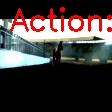

# Video Analysis Project

## Задание 1: Image Capturing

Видео было обработано моделью ResNet50 (предобученная на ImageNet).  
Результаты анализа каждого кадра:

**Топ-10 существительных, встречающихся в кадрах:**
- sorrel, seashore, muzzle, hairless, camel, horse, cart, ox, fountain, cowboy

**Топ-10 глаголов:**
- dogsled, bighorn, muzzle, coated, whippet, deerhound, triceratops, fountain, bow, ibex

**Кадры с подписями объектов:**  
  

**Вывод:**  
Модель распознала отдельные объекты, включая **horse** (лошадь), но многие предсказания были странными или не отражали действия на видео.  
**Гипотеза:** ResNet50 обучена на статичных изображениях и классифицирует объекты по ImageNet, поэтому динамика и контекст видео (например, бегающая лошадь) учитывается плохо.

---

## Задание 2: Video Action Recognition

Видео (первые 8 секунд) обработано лёгкой 3D CNN `r3d_18` (предобученная на Kinetics400).  
Предсказанное действие модели: **walking the dog**  
GIF с визуализацией предсказанного действия:  

**Вывод:**  
Модель распознала действие неверно — на самом видео **бежит лошадь**, а модель предсказала «walking the dog».  
**Гипотеза:** Модель обучена на 400 классах Kinetics400, в которых конкретных действий с лошадью нет, поэтому она пытается подобрать наиболее похожий класс по движениям.  
**Сильные стороны 3D CNN:**  
- Учет временной динамики движения  
- Моделирование видеопоследовательностей (не только отдельных кадров)

**Предложение по объединению подходов:**  
- Image capturing (ResNet50) помогает понять объекты (лошадь, человек, фон)  
- Video capturing (R3D-18 или SlowFast) — динамику действий  
- Комбинация этих моделей даст более точное описание видео, включая объекты и действия.

**Сложности video capturing по сравнению с image capturing:**  
- Нужно учитывать временной контекст (движение, скорость, траекторию)  
- Больший объём данных → дольше инференс и больше памяти  
- Труднее сопоставить действия с конкретными объектами на кадрах
